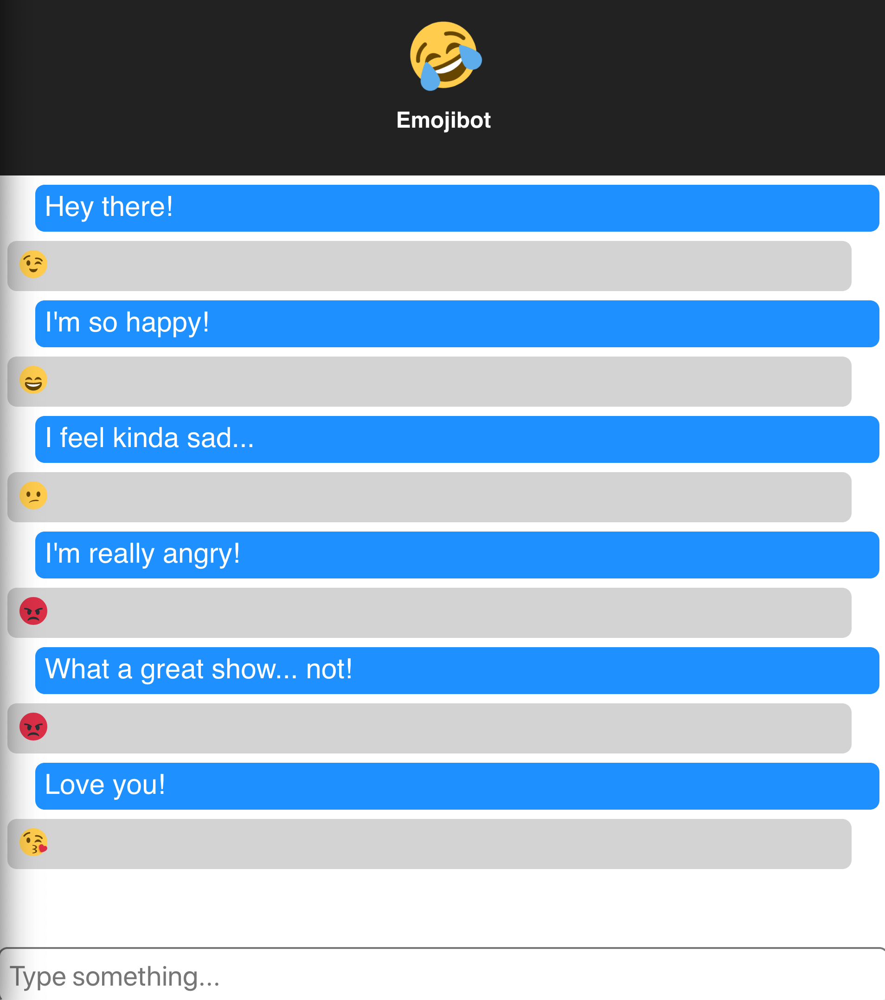
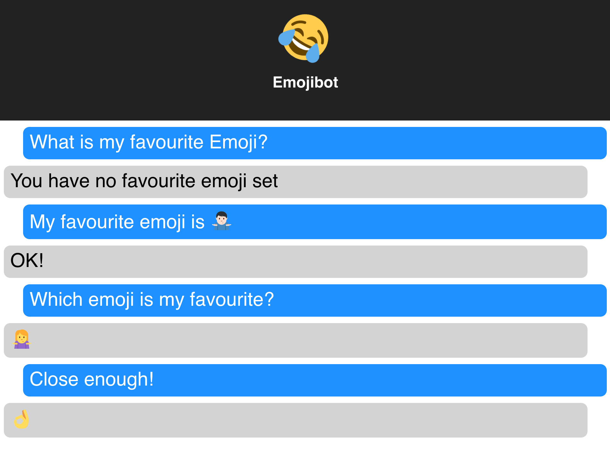

# Emojibot

Emojibot can predict how the user feels, and responds with a relevant Emoji.

You can also tell Emojibot your favourite Emoji and he'll remember it for later!

Most of the heavy lifting is done by [DeepMoji](https://github.com/bfelbo/DeepMoji) and an [intent matcher](https://github.com/JCGrant/emojibot/blob/master/app/matcher.py).

The only endpoint the server exposes is a GET handler to "/transform?s=some sentence".

## Running

This code depends on Python2, mostly because that's what DeepMoji uses.

    git clone git@github.com:JCGrant/emojibot.git
    cd emojibot
    pip install -r requirements.txt
    pushd client
    npm run build
    popd

    FLASK_APP=app flask run

Or, if you don't have Python binaries in your PATH:

    python run.py

## Testing

    pytest tests.py -v
